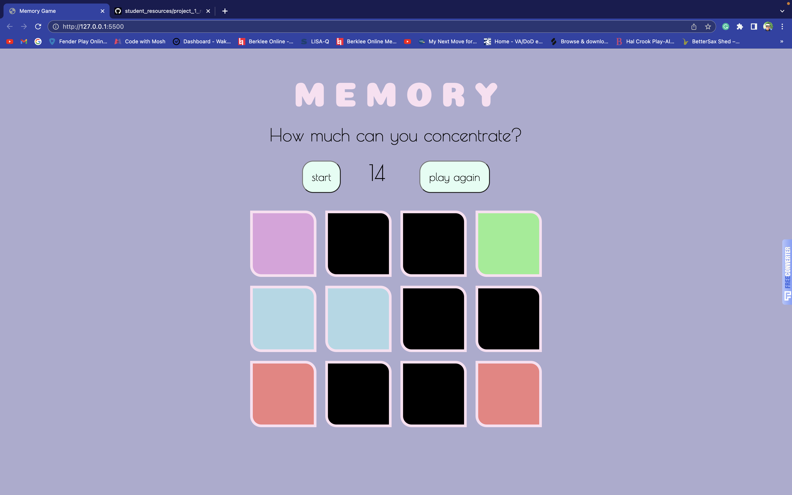

# sumi-memory-game

<Memory>

This memory game is built to test your memory to match 12 cards to their corresponding colors within a 30 second time frame. I chose it thinking I could manage building a simple game with minimal issues with my new found knowledge. Unfortunately I was wrong. 
I ended up going with the route of clicking on a grid rather than creating objects of cards, and due to my habitual organization methods, it caused me to create functions on a global scope rather than creating an initial function and building from there.
This caused so much more time, effort, and frustration one how to make the code the cleanest or more efficient. Definitely not a DRY code yet but, it worked out.

<Technologies Used>
Technologies that were used are HTML, CSS, and JavaScript with the assistance of google and my amazingly patient instructor.

<Getting Started>

Link to the game: 

Here's some snippets of the game with description of 'how to play'.

This is the game initially when the page loads. A simple two button game with the interactive "cards". To start, you press the start button which initiates the timer and start clicking on each block and try to match before the time runs out. 

This is what the game would look like while in play.

If you don't match all the cards before the time runs out, it will turn the subheading message to 'you lose!'

If you successfully match all the cards to their corresponding colors before the time ends, the subheading message will read 'you win!'

After the game is over, if you want to play again, just click the 'play again' button and it will refresh the page. Because my functions were all global, it would been much more complicated to fix from where I was already at with the amount of time I had left. So, simple solution: reload the page.

<Next Steps>
I will definitely improve the game over time with the visuals. I want to add more dynamics to the page with images and color, put a better countdown clock, and maybe some animations. But most importantly, I want to refactor the code to make it DRY.